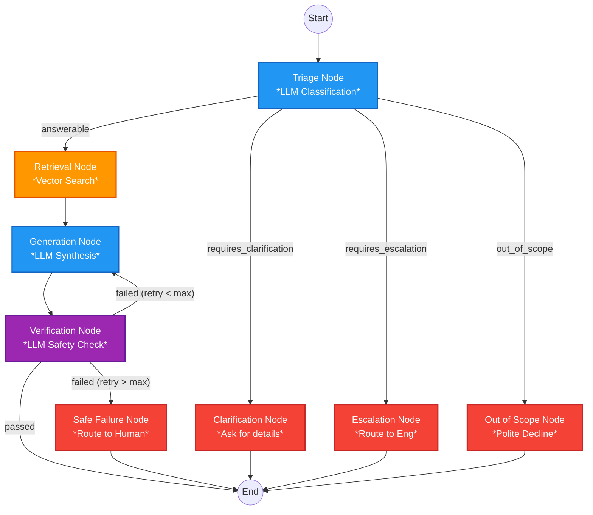

# OrbitDesk AI Support Agent Network

A local-first, graph-based AI support agent built to triage and resolve customer inquiries using the OrbitDesk knowledge base.

## Features

- **Triage**: Automatically classifies incoming requests as answerable, requires clarification, requires escalation, or out of scope.
- **Local AI Execution**: Uses Hugging Face pipelines (`sentence-transformers/all-MiniLM-L6-v2` for embeddings and `Qwen/Qwen2.5-0.5B-Instruct` for text generation) to ensure 100% offline capability and data privacy.
- **Graph Routing**: Uses an internal state machine (LangGraph pattern) to intelligently route tasks between retrieval, generation, and verification nodes.
- **Verification & Retry Loop**: Implements strict safety checking on generated answers (e.g., catching hallucinated policy violations) and automatically retries generation before falling back to a safe human escalation path.

## Architecture Diagram

The system operates on a state machine orchestrated by conditional routing logic:



## Setup Instructions

1. Install Python 3.10+
2. Install the requirements:
   ```bash
   pip install -r requirements.txt
   ```
3. Run the CLI tool:
   ```bash
   python main.py
   ```
4. Run the automated test suite:
   ```bash
   pytest tests/
   ```

## Model Details & Hardware Requirements

**Models Used:**
- Embedding Model: `sentence-transformers/all-MiniLM-L6-v2`
- Language Model: `Qwen/Qwen2.5-0.5B-Instruct` (0.5B Parameters)

**Hardware Used:**
- Standard CPU (Intel/AMD)
- No GPU/Accelerator required
- ~4GB RAM minimum required for model weights in memory

## Design Trade-offs & Limitations

1. **Model Size vs. Accuracy**: To ensure fast CPU inference and zero disk offloading, the lightweight `Qwen2.5-0.5B` was chosen over larger 1.5B+ parameter models. While it executes reasonably fast, it may occasionally struggle with highly complex multi-document synthesis compared to larger models.
2. **AI Safety Checking**: The verifier uses the same LLM to check for policy violations. A dedicated, faster classification model could be used here to reduce latency, but reusing the primary LLM reduces total memory overhead.

## AI Assistant Disclosure
This project was built with the assistance of an AI coding agent (Google Antigravity) during the development process to help refactor string-matching logic into dynamic system prompts and construct the data-driven test pipeline.
